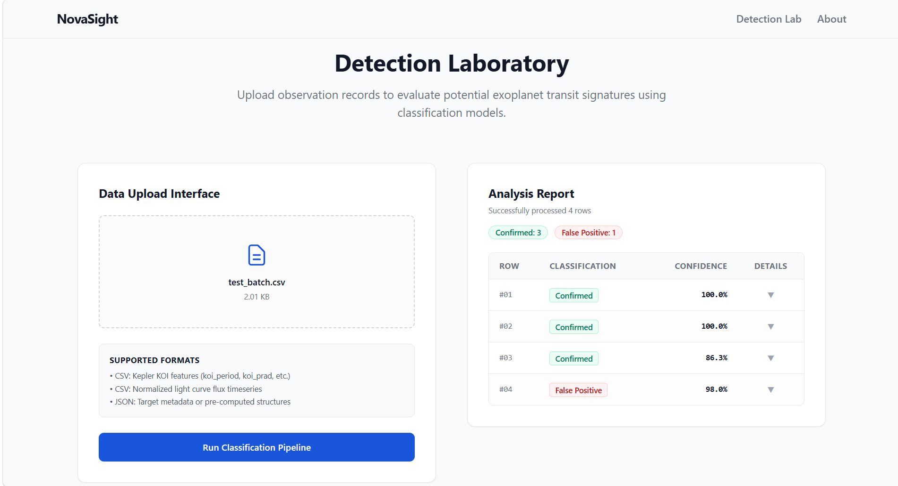

# NovaSight: Exoplanet Detection Platform

NovaSight is a full-stack, end-to-end exoplanet detection platform that uses machine learning to identify potential exoplanets from Kepler space telescope observations. The stack combines a **FastAPI backend**, a **React/Next.js frontend**, a robust **scikit-learn machine learning pipeline**, and a **Redis cache**, all orchestrated using **Docker Compose**.

---

## 🌌 Project Overview

The search for exoplanets (planets outside our Solar System) typically relies on the **transit method**, where astronomers measure the dip in light as a planet passes in front of its host star. NovaSight processes these observations (light curve transit depths, duration, orbital periods, stellar characteristics) to classify candidates as either **Confirmed Exoplanets** or **False Positives**.

### 🌟 Key Features
- **NASA Data Fetcher**: Automates downloads of official Kepler, K2, and TESS datasets directly from the NASA Exoplanet Archive.
- **High-Performance ML Classifier**: An optimized Random Forest model achieving **98.5% accuracy** on Kepler Objects of Interest (KOI).
- **Real-Time Prediction API**: Serving fast, scaled inferences via a REST API.
- **Explainable AI**: Provides feature importance rankings (using Gini importances / Tree SHAP fallbacks) to explain exactly why a candidate was classified as an exoplanet.
- **Interactive Lab Dashboard**: A premium user interface featuring drag-and-drop CSV batch upload, real-time predictions, visual feedback, and user authentication.
- **Docker Orchestrated**: Simple, single-command container deployment for the entire stack.



---

## 📊 Model Performance

The platform ships with a Random Forest classifier trained on the NASA Kepler cumulative object dataset. Features are automatically aligned, imputed, and scaled using `StandardScaler` to ensure robust inference.

### 📈 Evaluation Metrics
Evaluated on a stratified 20% test split:

| Metric | Score |
| :--- | :--- |
| **Accuracy** | 98.54% |
| **Precision** | 99.25% |
| **Recall** | 97.78% |
| **F1-Score** | 98.51% |
| **ROC AUC** | 0.9993 |

The confusion matrix and feature importances are automatically generated and saved under `ml/results/` for transparency and auditability.

---

## 📁 Repository Structure

```text
novasight/
├── backend/                  # FastAPI Application
│   ├── app/
│   │   ├── api/
│   │   │   ├── auth.py       # JWT session auth (in-memory user db)
│   │   │   └── predict.py    # Single and batch prediction endpoints
│   │   ├── auth.py           # User creation, password hashing, and token verification
│   │   ├── model_loader.py   # Loader with scaler integration & features mapping
│   │   └── main.py           # FastAPI entry point & CORS configuration
│   └── Dockerfile            # Multi-stage slim Python container
├── frontend/                 # React/Next.js Application
│   ├── components/           # Space background, interactive Lab, and Auth UI
│   ├── pages/                # Main dashboard page
│   ├── next.config.js        # API dev proxy rewrite configuration
│   └── Dockerfile            # Optimized Alpine-based Node container
├── ml/                       # Machine Learning Pipeline
│   ├── data/raw/             # Downloaded Kepler KOI datasets
│   ├── models/               # Saved model.pkl, scaler.pkl, and configs
│   ├── results/              # Confusion matrix plots and metrics JSON
│   └── src/
│       ├── fetch_nasa.py     # Data fetcher from NASA TAP URL
│       ├── train.py          # Model training, scaling, & config generation script
│       ├── evaluate.py       # Metrics calculator & Confusion Matrix plotter
│       └── explain.py        # Explainability & feature importance utilities
├── docs/                     # Detailed guides and developer docs
│   ├── api-docs.md           # API specification and curl examples
│   ├── development.md        # Local workspace setup guide
│   └── docker-guide.md       # Docker and container orchestration manual
├── docker-compose.yml        # Development environment docker configuration
└── README.md                 # Project root documentation
```

---

## 🚀 Quick Start (Local Development)

### Prerequisites
- Python 3.10+
- Node.js 18+
- npm

### 1. Set Up the Machine Learning Pipeline

```bash
# Clone the repository
git clone https://github.com/MosadCreates/novasight.git
cd novasight

# Set up virtual environment
python -m venv venv
source venv/bin/activate  # On Windows: venv\Scripts\activate

# Install ML dependencies
pip install -r ml/requirements.txt

# 1. Fetch Kepler KOI cumulative dataset
python ml/src/fetch_nasa.py --dataset kepler_koi

# 2. Train the Random Forest Model
python ml/src/train.py ml/data/raw/kepler_koi_20260613.csv --label-column koi_disposition --output ml/models/model.pkl

# 3. Verify Model Evaluation
python ml/src/evaluate.py
```

### 2. Start the Backend API

```bash
cd backend
# Install dependencies
pip install -r requirements.txt -r requirements-dev.txt

# Start FastAPI server
uvicorn app.main:app --reload --host 127.0.0.1 --port 8000
```
- API Health Endpoint: http://localhost:8000/health
- Swagger API docs: http://localhost:8000/docs

### 3. Start the Frontend Dashboard

```bash
cd ../frontend
# Install npm dependencies
npm install

# Run the Next.js dev server
npm run dev
```
- Frontend application: http://localhost:3000

---

## 🐳 Running with Docker Compose

To start the entire environment (FastAPI backend, Next.js frontend, and Redis caching server) with a single command:

```bash
# From the project root
docker-compose up --build
```

### Port Mappings
- **Frontend App**: http://localhost:3000
- **FastAPI Server**: http://localhost:8000
- **API Docs (Swagger)**: http://localhost:8000/docs
- **Redis Server**: `localhost:6379`

---

## 🔒 Authentication Notes
The backend supports user registration and login using JWT session tokens. 
- For demonstration simplicity in this portfolio prototype, users are stored in an **in-memory database** dictionary in `backend/app/auth.py`. 
- **Planned Work**: Persistence utilizing SQLite or PostgreSQL is listed in the future roadmap.

---

## 🗺️ Roadmap & Future Work
- [ ] **Database Integration**: Transition the session auth database from in-memory to PostgreSQL/SQLite.
- [ ] **Raw Light-Curve Time-Series**: Train 1D CNNs or LSTMs to classify raw time-series flux signals rather than tabular pre-extracted Kepler attributes.
- [ ] **Multi-Class Classification**: Extend the model to explicitly separate *Candidates* from *Confirmed* exoplanets, rather than grouping them into a binary (Positive vs False Positive) target.

---

## 🤝 Contributing

Contributions are welcome! Please feel free to open a Pull Request or report issues. 

1. Fork & clone repository.
2. Create a feature branch (`git checkout -b feature/amazing-feature`).
3. Format with `black` and `flake8`.
4. Submit a Pull Request.

---

## 📜 License
This project is licensed under the MIT License.

## ✍️ Author
Created and maintained by [Mohamed Mosad](https://github.com/MosadCreates). Built with passion for astronomy and data science.
